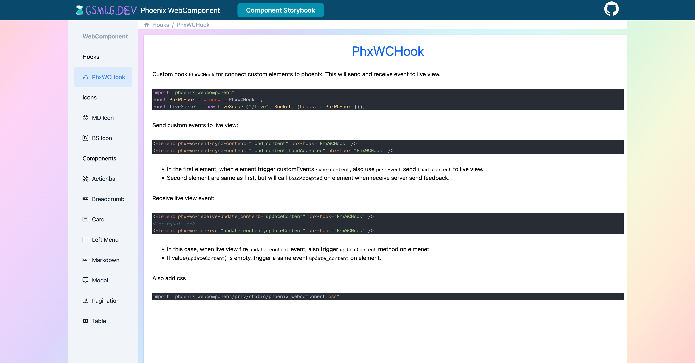
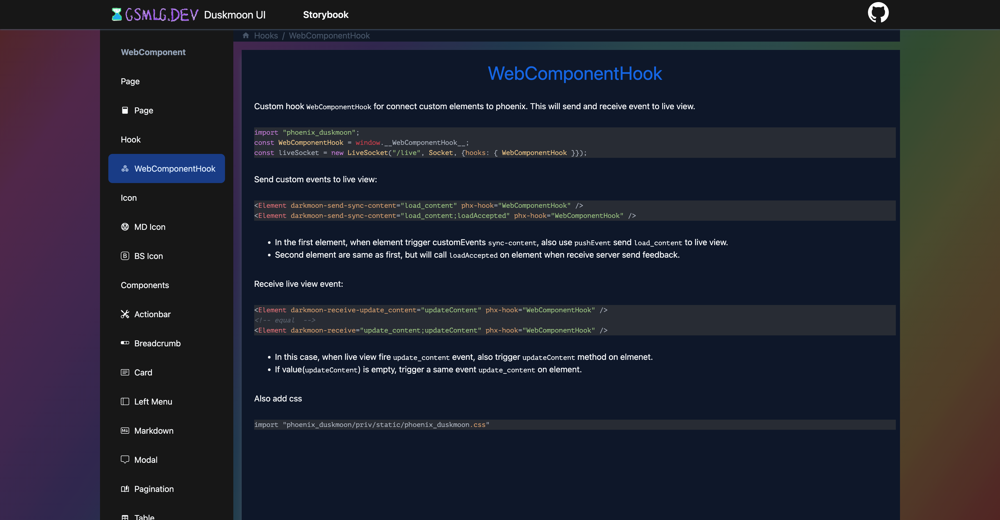
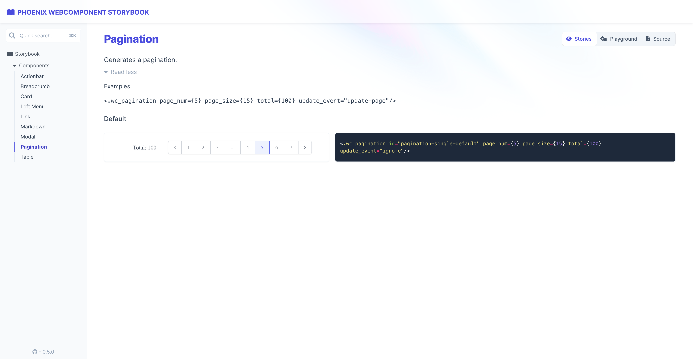
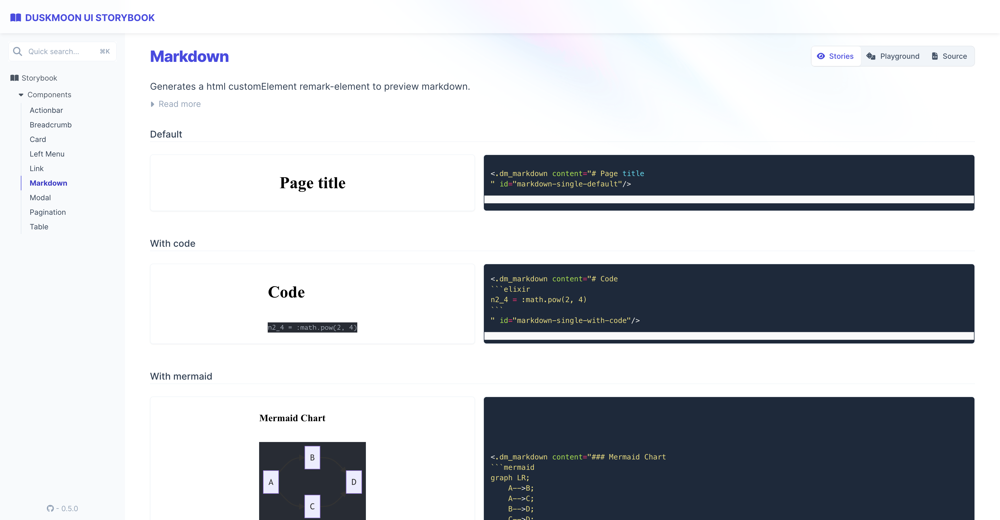

# PhoenixDuskmoon

[](https://github.com/duskmoon-dev/phoenix-duskmoon-ui/actions/workflows/ci.yml)
[](https://github.com/duskmoon-dev/phoenix-duskmoon-ui/actions/workflows/release.yml)
[](https://hex.pm/packages/phoenix_duskmoon)
[](https://hexdocs.pm/phoenix_duskmoon/)
[](https://www.npmjs.com/package/phoenix_duskmoon)

Duskmoon UI component library for Phoenix LiveView applications.

**v9**: Uses `@duskmoon-dev/core` CSS design system, HTML Custom Elements (`@duskmoon-dev/elements`), and Art Custom Elements (`@duskmoon-dev/art-elements`).

Requires `tailwindcss >= 4.0`

See the [docs](https://hexdocs.pm/phoenix_duskmoon/) for more information.


## Install

Add to `mix.exs`:

```elixir
{:phoenix_duskmoon, "~> 9.0"},
```

Install frontend packages:

```bash
bun add @duskmoon-dev/core @duskmoon-dev/elements
```

Optionally, add CSS Art and Art Custom Elements support:

```bash
bun add @duskmoon-dev/css-art @duskmoon-dev/art-elements
```

### View Helpers

Add to your Phoenix view helpers (e.g. `lib/my_app_web.ex`):

```elixir
defp html_helpers do
  quote do
    # Standard UI components (buttons, cards, forms, navigation, etc.)
    use PhoenixDuskmoon.Component
    # CSS Art decorative components (snow, plasma ball, eclipse, etc.)
    use PhoenixDuskmoon.ArtComponent
  end
end
```

### CSS Setup

In your CSS entry file (e.g. `assets/css/app.css`):

```css
@import "tailwindcss";
@plugin "@duskmoon-dev/core/plugin";
@import "phoenix_duskmoon/components";
```

### JavaScript Setup

Register the custom elements in `assets/js/app.js`:

```javascript
import "@duskmoon-dev/elements/register";
// Optionally, register art custom elements
import "@duskmoon-dev/art-elements/register";
```

### Hooks Setup

Some components require LiveView hooks. Add them when creating your `LiveSocket`:

```javascript
import {LiveSocket} from "phoenix_live_view"
import * as DuskmoonHooks from "phoenix_duskmoon/hooks"

let liveSocket = new LiveSocket("/live", Socket, {
  params: {_csrf_token: csrfToken},
  hooks: DuskmoonHooks
})
```

Components that require hooks:
- `<.dm_theme_switcher>` — theme switching with localStorage
- `<.dmf_spotlight>` — keyboard shortcut handling (Cmd/Ctrl+K)
- `<.dm_page_header>` — scroll-based intersection observer


## Usage

### Buttons

```heex
<.dm_btn variant="primary">Click me</.dm_btn>
<.dm_btn variant="secondary" loading={@loading}>Loading</.dm_btn>
<.dm_btn variant="error" shape="circle">×</.dm_btn>
```

### Cards

```heex
<.dm_card class="p-6">
  <:title><h3>Title</h3></:title>
  <p>Content here</p>
  <:footer><.dm_btn>Action</.dm_btn></:footer>
</.dm_card>
```

### Icons

```heex
<.dm_mdi name="home" />
<.dm_bsi name="house" />
```

### Forms

```heex
<.dm_form for={@form} phx-submit="save">
  <.dmf_input field={@form[:email]} label="Email" />
  <.dm_btn variant="primary" type="submit">Save</.dm_btn>
</.dm_form>
```

### Common Attributes

| Attribute | Values |
|-----------|--------|
| `variant` | `primary`, `secondary`, `accent`, `info`, `success`, `warning`, `error`, `ghost`, `link`, `outline` |
| `size`    | `xs`, `sm`, `md`, `lg` |
| `shape`   | `square`, `circle` |
| `loading` | boolean |
| `disabled`| boolean |
| `class`   | additional CSS classes |


## Available Components

- **Action**: buttons, dropdowns, links, menus, toggles
- **Data Display**: accordion, avatar, badge, card, chip, collapse, flash, list, markdown, pagination, popover, progress, skeleton, stat, table, timeline, tooltip
- **Data Entry**: autocomplete, cascader, checkbox, compact input, file upload, form, input, multi-select, OTP input, PIN input, radio, rating, segment control, select, slider, switch, textarea, time input, tree select
- **Feedback**: dialog, loading, snackbar, toast
- **Navigation**: actionbar, appbar, bottom nav, breadcrumb, left menu, navbar, nested menu, page footer, page header, stepper, steps, tabs
- **Layout**: bottom sheet, divider, drawer, theme switcher
- **CSS Art**: button noise, eclipse, plasma ball, signature, snow, spotlight search


## Live Storybook

[Live Storybook](https://duskmoon-storybook.gsmlg.dev)





