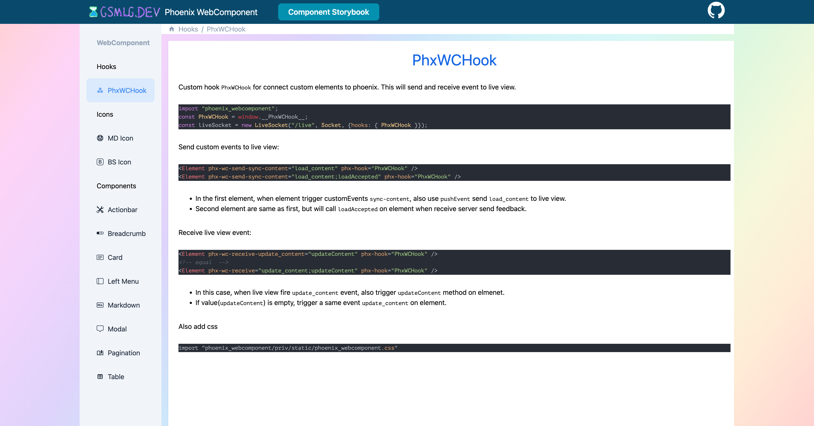
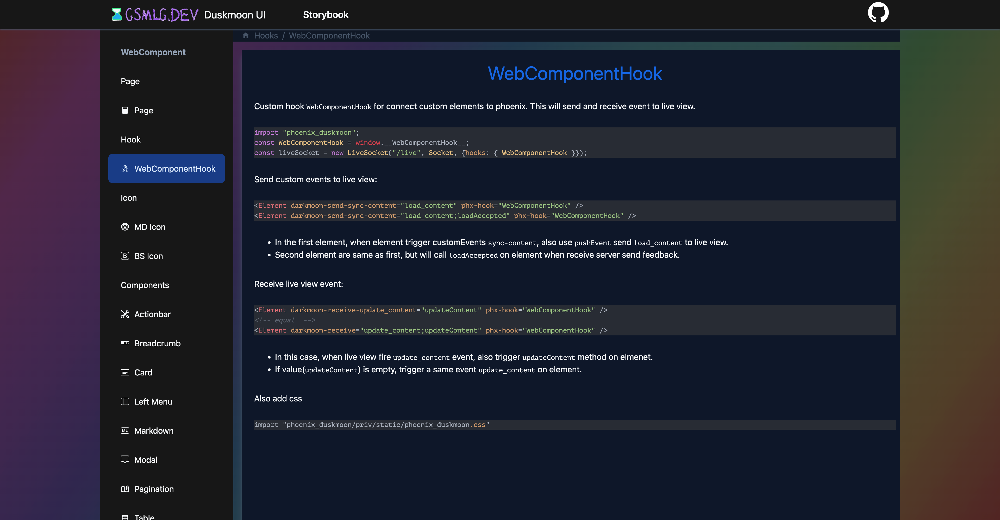
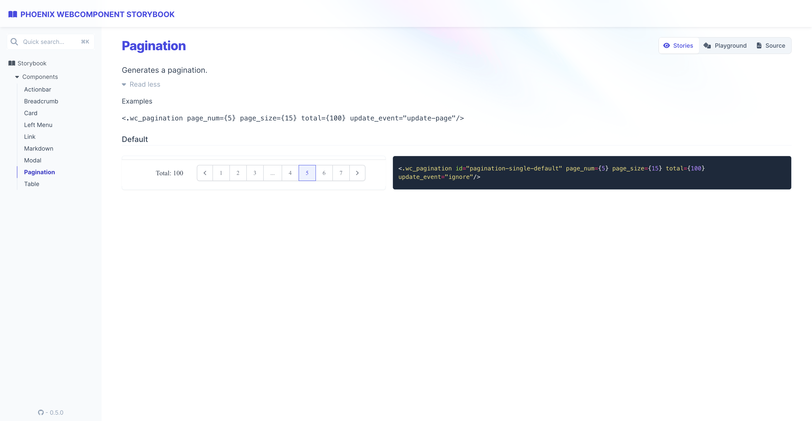
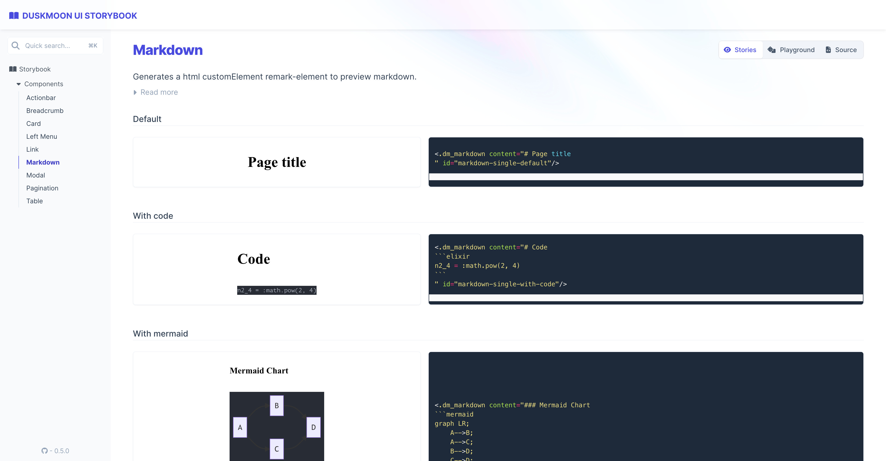

# PhoenixDuskmoon

[](https://github.com/duskmoon-dev/phoenix-duskmoon-ui/actions/workflows/ci.yml)
[](https://github.com/duskmoon-dev/phoenix-duskmoon-ui/actions/workflows/release.yml)
[](https://hex.pm/packages/phoenix_duskmoon)
[](https://hexdocs.pm/phoenix_duskmoon/)
[](https://www.npmjs.com/package/phoenix_duskmoon)

Duskmoon UI component library for Phoenix LiveView applications.

**v9**: Uses `@duskmoon-dev/core` CSS design system, HTML Custom Elements (`@duskmoon-dev/elements`), and Art Custom Elements (`@duskmoon-dev/art-elements`).

Requires `tailwindcss >= 4.0`

See the [docs](https://hexdocs.pm/phoenix_duskmoon/) for more information.


## Install

Add to `mix.exs`:

```elixir
{:phoenix_duskmoon, "~> 9.0"},
```

Install frontend packages:

```bash
bun add @duskmoon-dev/core @duskmoon-dev/elements
```

Optionally, add CSS Art and Art Custom Elements support:

```bash
bun add @duskmoon-dev/css-art @duskmoon-dev/art-elements
```

### View Helpers

Add to your Phoenix view helpers (e.g. `lib/my_app_web.ex`):

```elixir
defp html_helpers do
  quote do
    # Standard UI components (buttons, cards, forms, navigation, etc.)
    use PhoenixDuskmoon.Component
    # CSS Art decorative components (snow, plasma ball, eclipse, etc.)
    use PhoenixDuskmoon.ArtComponent
  end
end
```

### CSS Setup

In your CSS entry file (e.g. `assets/css/app.css`):

```css
@import "tailwindcss";
@plugin "@duskmoon-dev/core/plugin";
@import "phoenix_duskmoon/components";
```

### JavaScript Setup

Register the custom elements in `assets/js/app.js`:

```javascript
import "@duskmoon-dev/elements/register";
// Optionally, register art custom elements
import "@duskmoon-dev/art-elements/register";
```

### Hooks Setup

Some components require LiveView hooks. Add them when creating your `LiveSocket`:

```javascript
import {LiveSocket} from "phoenix_live_view"
import * as DuskmoonHooks from "phoenix_duskmoon/hooks"

let liveSocket = new LiveSocket("/live", Socket, {
  params: {_csrf_token: csrfToken},
  hooks: DuskmoonHooks
})
```

Components that require hooks:
- `<.dm_theme_switcher>` — theme switching with localStorage
- `<.dmf_spotlight>` — keyboard shortcut handling (Cmd/Ctrl+K)
- `<.dm_page_header>` — scroll-based intersection observer


## Usage

### Buttons

```heex
<.dm_btn variant="primary">Click me</.dm_btn>
<.dm_btn variant="secondary" loading={@loading}>Loading</.dm_btn>
<.dm_btn variant="error" shape="circle">×</.dm_btn>
<.dm_btn native_submit variant="primary">Submit without JavaScript</.dm_btn>
```

### Cards

```heex
<.dm_card class="p-6">
  <:title><h3>Title</h3></:title>
  <p>Content here</p>
  <:footer><.dm_btn>Action</.dm_btn></:footer>
</.dm_card>
```

### Icons

```heex
<.dm_mdi name="home" />
<.dm_bsi name="house" />
```

### Forms

```heex
<.dm_form for={@form} phx-submit="save">
  <.dmf_input field={@form[:email]} label="Email" />
  <.dm_btn variant="primary" type="submit">Save</.dm_btn>
</.dm_form>
```

### Common Attributes

| Attribute | Values |
|-----------|--------|
| `variant` | `primary`, `secondary`, `accent`, `info`, `success`, `warning`, `error`, `ghost`, `link`, `outline` |
| `size`    | `xs`, `sm`, `md`, `lg` |
| `shape`   | `square`, `circle` |
| `loading` | boolean |
| `disabled`| boolean |
| `native_submit` | boolean; render a native no-JavaScript submit control |
| `class`   | additional CSS classes |


## Available Components

- **Action**: buttons, dropdowns, floating actions, links, menus, swaps, toggles
- **Data Display**: accordion, avatar, badge, card, carousel, chat, chat scroll, chip, collapse, countdown, datetime, diff, keyboard keys, flash, git repository, list, markdown, markdown body, pagination, popover, progress, radial progress, skeleton, stat, table, timeline, tooltip
- **Data Entry**: autocomplete, cascader, checkbox, compact input, file upload, filter group, form, input, multi-select, OTP input, PIN input, radio, rating, segment control, select, slider, switch, textarea, time input, tree select
- **Feedback**: dialog, loading, snackbar, toast
- **Navigation**: actionbar, appbar, bottom nav, breadcrumb, left menu, megamenu, navbar, nested menu, page footer, page header, stepper, steps, tabs
- **Layout**: bottom sheet, divider, drawer, hero, indicator, join, mask, sidebar layout, stack, theme switcher
- **CSS Art**: button noise, eclipse, plasma ball, signature, snow, spotlight search


## Upstream design alignment

The current frontend uses Core/CSS Art 1.19.9 and Elements/Art Elements 1.7.6.
Individually published element dependencies are pinned to their current versions;
see the [contract audit](apps/phoenix_duskmoon/guides/upstream-design-alignment.md) for the exact set.

The new Core primitives render native HTML and use the packaged CSS. Applications
own countdown timing, filter state, progress values and layout state. Carousel uses
native scrolling, swap uses a checkbox, floating actions and megamenu
use the browser Popover API. No element registration is needed for these primitives.

```heex
<.dm_indicator>
  <:indicator><span class="badge badge-primary">3</span></:indicator>
  <button type="button" class="btn">Inbox</button>
</.dm_indicator>

<.dm_sidebar_layout>
  <:sidebar><nav aria-label="Workspace">Workspace links</nav></:sidebar>
  <main>Page content</main>
</.dm_sidebar_layout>
```

Existing `dm_menu`, `dm_drawer` and `dm_bottom_sheet` retain their Elements methods
and events. `dm_loading_spinner` now follows Core's reduced-motion behavior, and
`dm_stat` uses its semantic stat layout. Chat scroll and chip event examples are
available in Storybook. Browser `File` objects from chat events require the
application's upload mechanism; they cannot be sent as LiveView JSON payloads.

## Live Storybook

[Live Storybook](https://duskmoon-storybook.gsmlg.dev)





