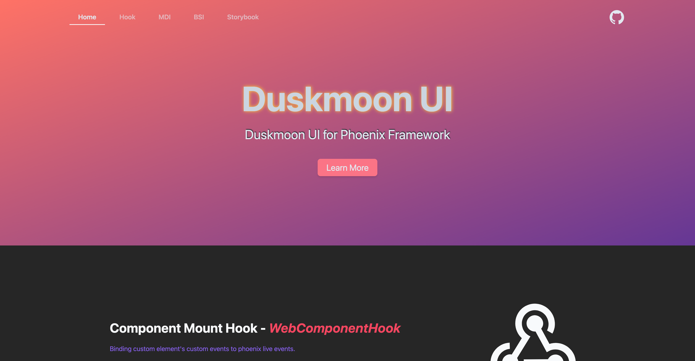
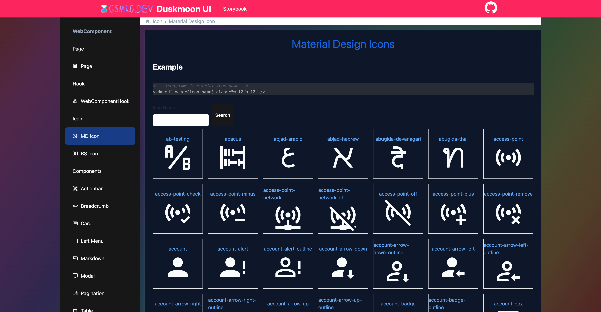

# PhoenixDuskmoon

[](https://github.com/duskmoon-dev/phoenix-duskmoon-ui/actions/workflows/test-and-release.yml)

Provides Duskmoon UI for Phoenix project.

**v9**: Uses `@duskmoon-dev/core` CSS design system and HTML Custom Elements (`duskmoon-elements`).

Requires `tailwindcss >= 4.0`

See the [docs](https://hexdocs.pm/phoenix_duskmoon/) for more information.


## Install

Add deps in `mix.exs`
```elixir
    {:phoenix_duskmoon, "~> 9.0"},
```

Install npm packages:
```bash
npm install @duskmoon-dev/core duskmoon-elements
# or
bun add @duskmoon-dev/core duskmoon-elements
```

Include in phoenix view helpers

```elixir
defp html_helpers do
  quote do
    # import all duskmoon ui component
    use PhoenixDuskmoon.Component
    # import all duskmoon ui fun component
    use PhoenixDuskmoon.Fun
  end
end
```

Import `css`

```css
@source "../js/**/*.js";
@source '../../lib/**/*.exs';
@source '../../lib/**/*.ex';

@import "tailwindcss";
@import "@duskmoon-dev/core";
@import "phoenix_duskmoon/components";
```

## Live Storybook

[Live Storybook](https://duskmoon-storybook.gsmlg.dev)





